# Crown-Chaos
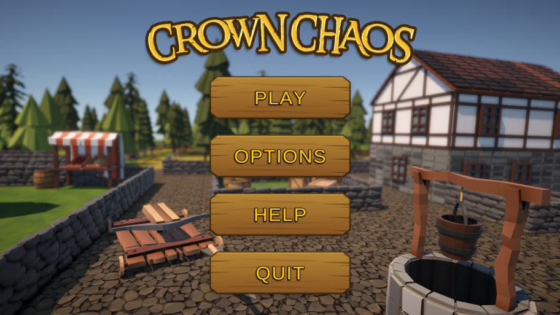
## Overview
Crown Chaos is a three-dimensional, top-down, medieval themed deathmatch game. 
Players control ballista’s in a maze and the objective is to eliminate all and any AI controlled enemy ballistas. 
Players are also able to find powerups and boosts in the environment. 
The winner is determined by the ballista with the most kills by the end of the timer.
## Features
### Power-ups
* Enhanced-sight - The player is able to see more of the map around them.
* Shield - The player becomes invincible to 1 shot. During the time the player can shoot and a visual shield will show around the player to let other players know of the power-up.
* Speed boost - The player’s movement speed is increased by a factor of 1.5.
* Infinite Ammo - The player’s ammo instantly restocks to full and will remain full for the duration of the power-up. Additionally the players bolts will reload quicker, allowing for a faster fire rate.
* Buckshot Bolts - The player is able to fire 3 bolts instead of a single bolt that will spread out in a shotgun fashion.
* Ghost Bolt - The player can fire a single bolt that is able to travel through walls but can still hit other players.
### Controls
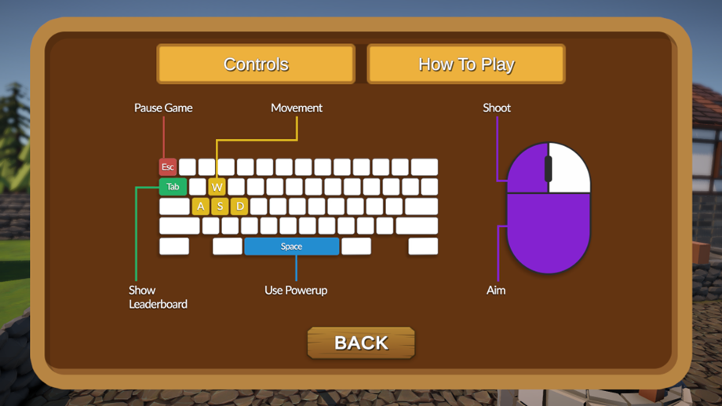
### HUD
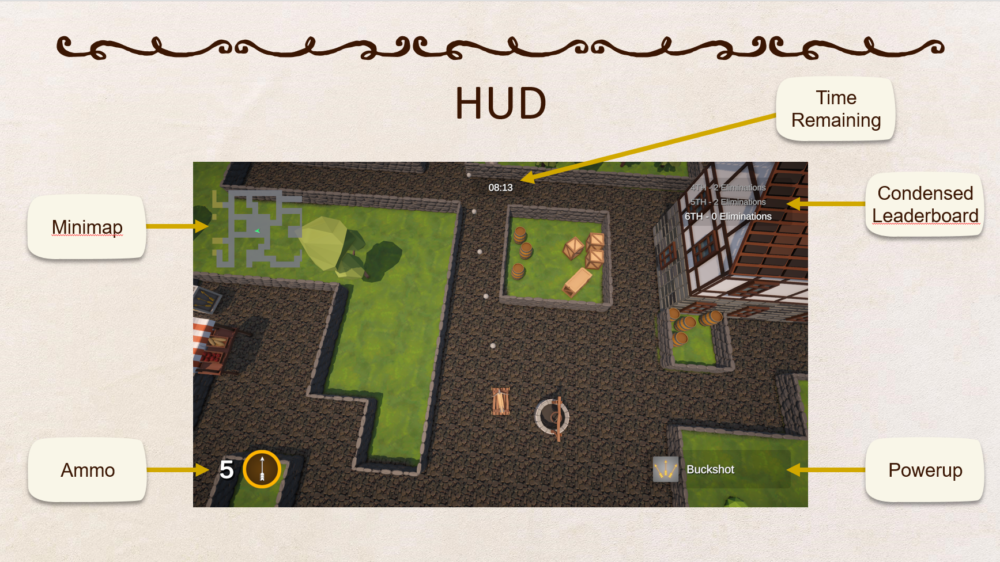
### Ammo System
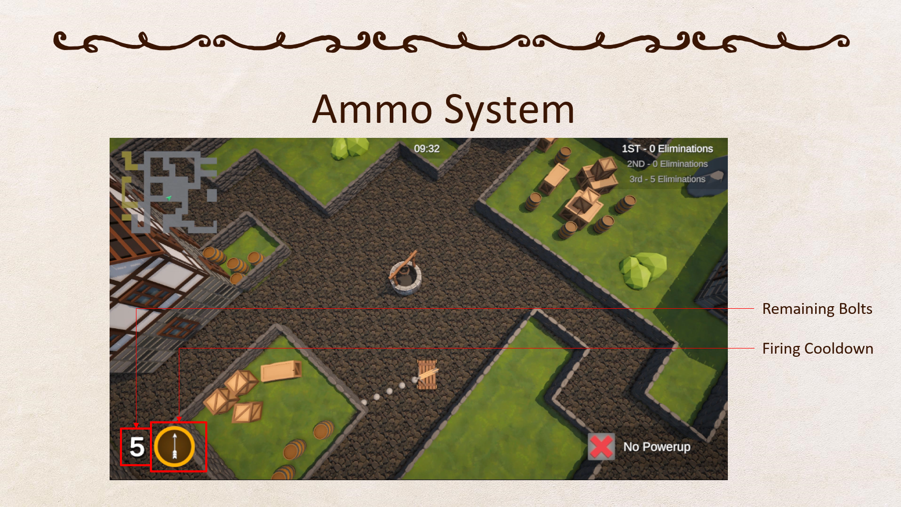
The ammo system is made up of two parts. 
A cooldown of one second to reload a bolt to fire and continualy refilling total supply of botls.
### Leaderboard
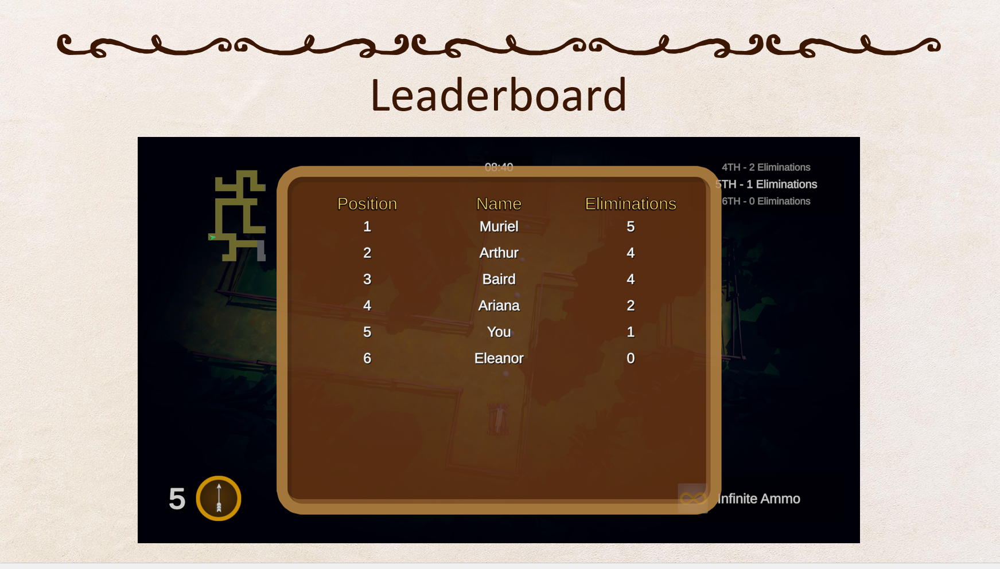
By pressing tab a leaderboard will be displayed, showing each players score and their position amoung all of the players.
### Environment
#### Map
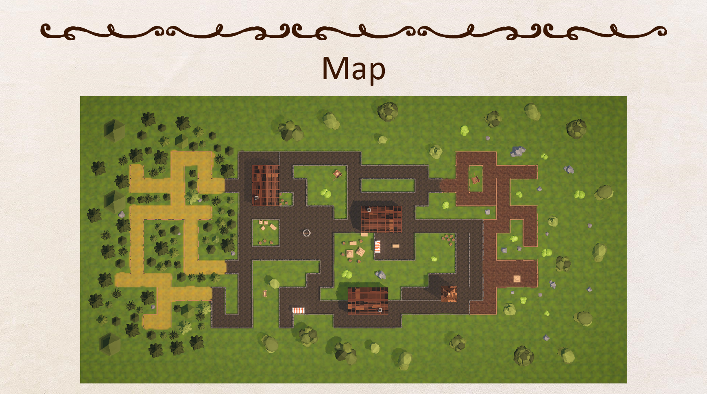
The area that the players fight in is a maze. There are vaious obsticles scattered throughout the maze along with decor situated outside of the playable area.
#### Environment Demo

#### Ending Screen
Once a player reaches 30 kills or the timer for the game length expires, a victory screen will be displayed if the player is first in the leaderboard or a defeat screen if not.
##### Victory Screen
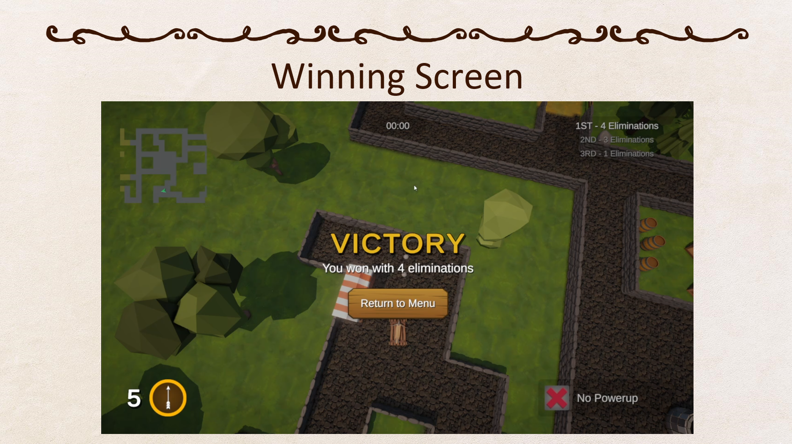
##### Defeat Screen
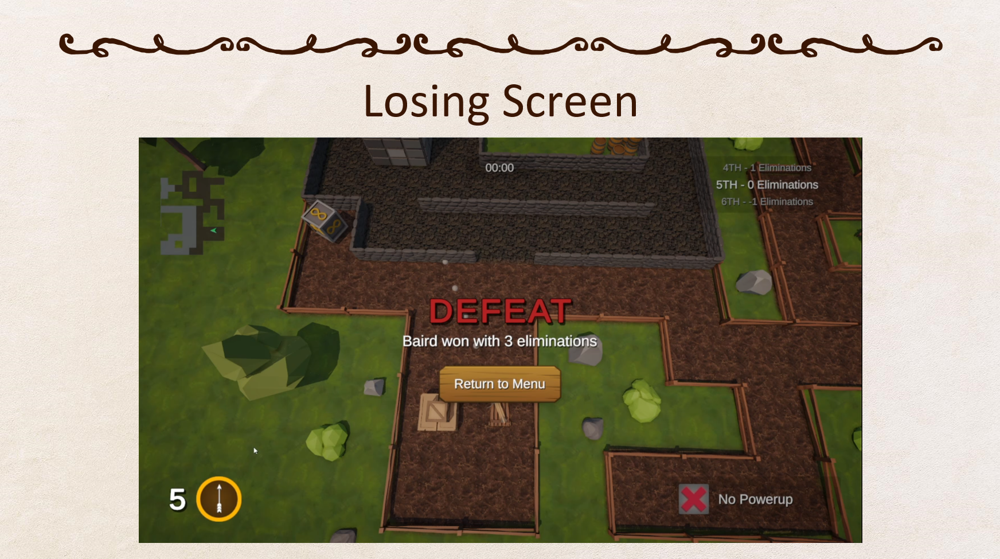
### AI
To enabe the AI to navigate around the map, preproccesing is done to speedup the later calculations. The first step is converting the map into a grid of nodes.
#### Map Preproccessing
* Creating a map object to provide preproccess the environment
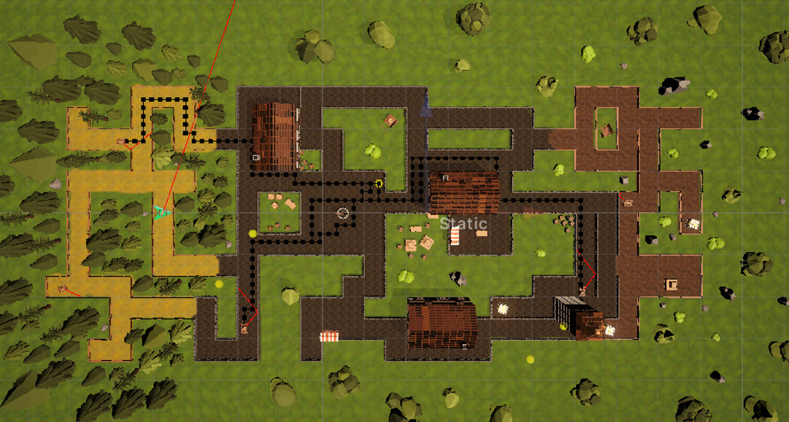
* Dividing the map into a grid of nodes
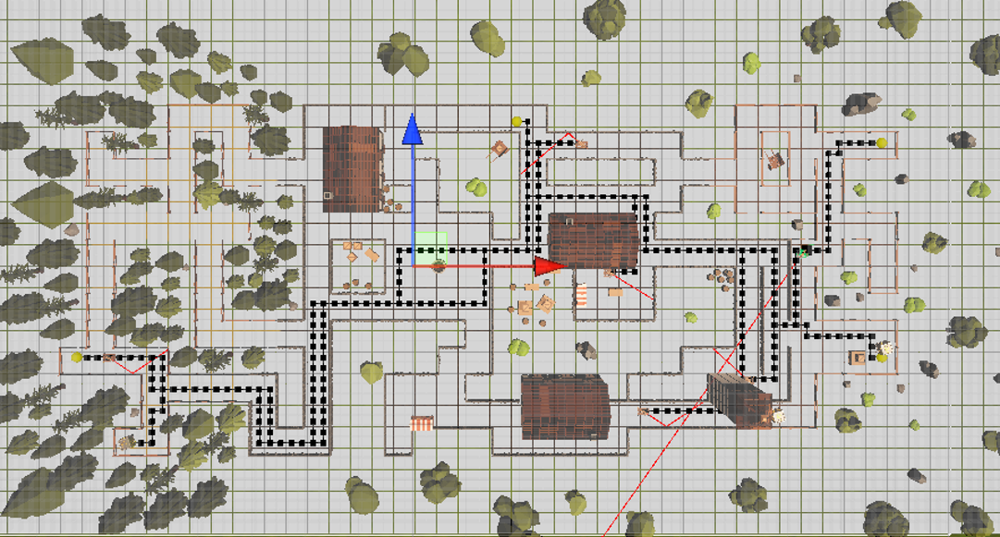
* Performing collision detection on each grid location, to exclude locations with objects and walls
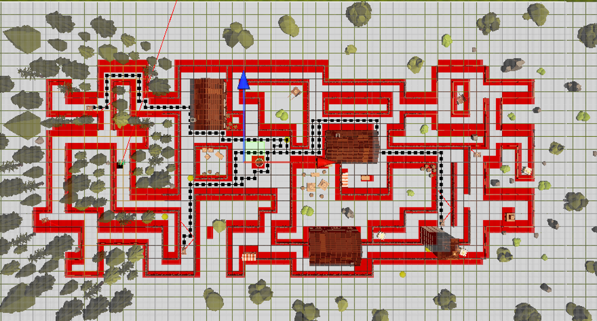
* Calculate if the terrain at a point is traversible or in an invalid location (grassland outside of the maze)
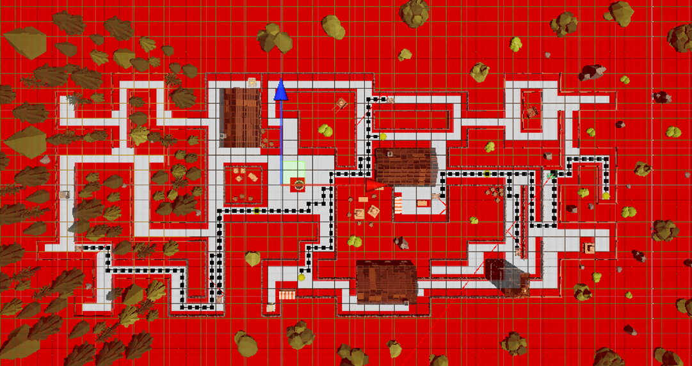
#### AI Navigation
To perform navigation the AI will select a valid target location on the map. This can be seen by the yellow sphere.
Then the AI will make a request to a PathProvider object, to use the A* (Alpha-star) pathfinding techneque to calculate the shortest route to the destination given the objects location.
A serries of waypoints will be returned and are represented by black cubes, which the AI will follow.
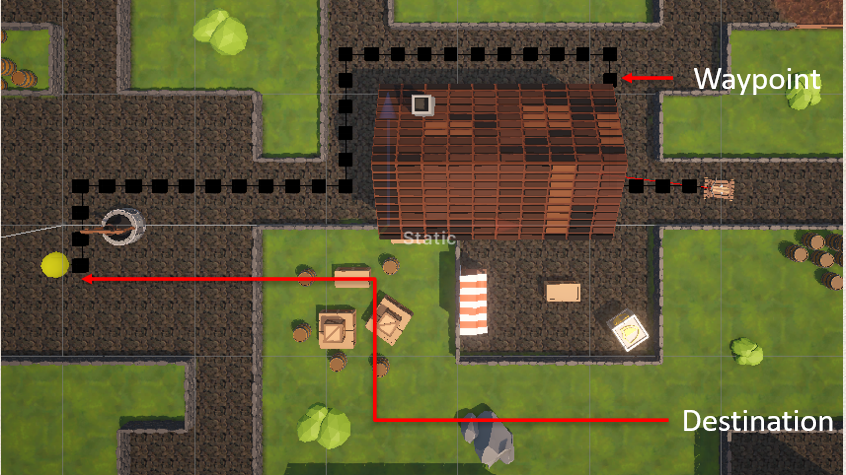
#### AI Aiming
To aim, the AI will cast a ray in the direction of its crossbow. The ray will have a maximum distance and maximum number of bounces it can make depending on the difficulty level of the AI.
If the AI detects an enemy colliding with the ray, it will attempt to shoot in the targets direction. 
The AI will also retreat slightly while it is reloading to reduce its chances of being hit.
To detect enemies in a larger range of angles, it will pivot its aim between 45° to the left and right of its fowards direction. 
And occasionaly it will spin around allowing it to detect enemies behind it.
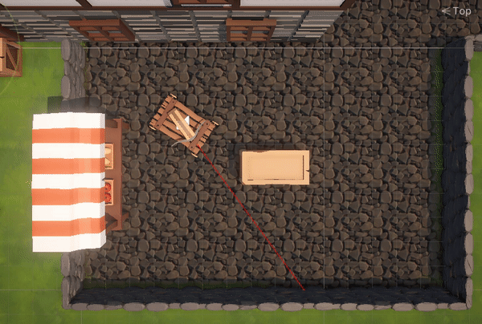
##### Higher Difficulty AI Aim
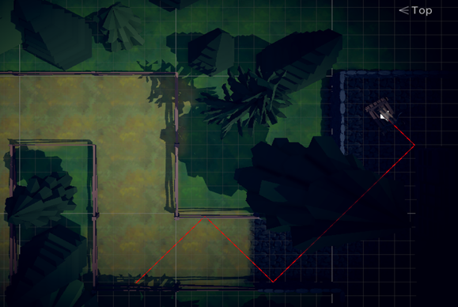